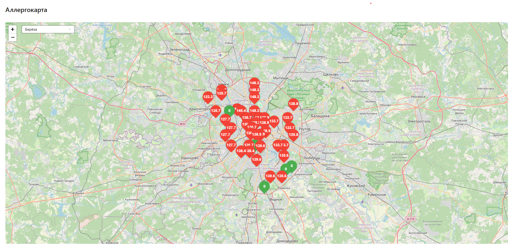

# 🌿 Аллергокарта (Allergy Forecast Map)

Интерактивное приложение на базе Next.js, отображающее уровни пыльцы различных аллергенов (берёза, ольха, злаки и т.д.) на карте Москвы. Данные берутся с публичного API Open-Meteo и визуализируются с помощью Leaflet.

---

## 📷 Скриншот



---

## 🚀 Демо

> _Планируется развертывание на Vercel / Netlify_

---

## 📦 Технологии

- **Next.js** (SSR и API routes)
- **TypeScript**
- **React + Hooks**
- **Ant Design** — UI-компоненты
- **Leaflet + React-Leaflet** — карта
- **Open-Meteo API** — источник данных о пыльце
- **Dynamic Imports** — для загрузки карты без SSR

---

## ⚙️ Установка и запуск

```bash
# 1. Клонируй репозиторий
git clone https://github.com/your-username/allergy-map.git
cd allergy-map

# 2. Установи зависимости
npm install

# 3. Запусти локально
npm run dev
```
